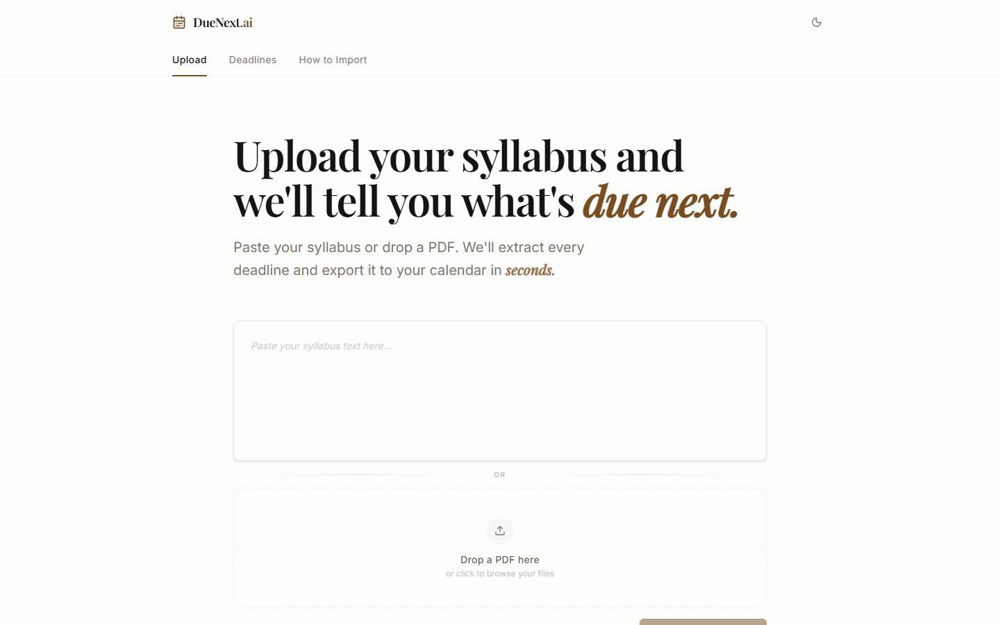
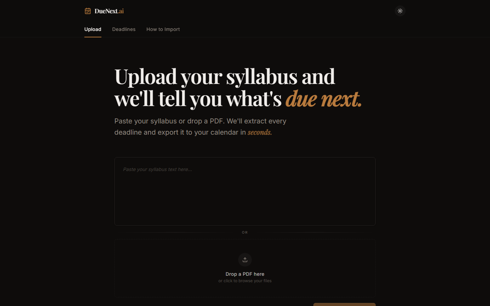

# duenext.ai

[](https://github.com/NebulaKamrul/Due-Next-AI/actions/workflows/ci.yml)

> *no more scrolling through 40 pages of syllabus to find one due date.*

paste your syllabus. or upload the pdf. ai pulls every assignment, every deadline, every weight automatically. review it, edit it, and export straight to google calendar as an `.ics` file. built because i hated manually writing down my due dates in my google calendar.

**[live demo →](https://due-next-ai.vercel.app)**

<p align="center">
  
  
</p>

---

## features

- **paste or upload** - plain text or pdf, both work
- **ai extraction** - assignments, dates, and weights pulled automatically
- **edit everything** - title, date, type, color, weight
- **9 assignment types** - assignment / quiz / test / exam / midterm / final / practical / class activity / other
- **.ics export** - drops straight into google calendar
- **dark mode** - obviously

---

## tech stack

| layer | tool |
|---|---|
| frontend | [React](https://react.dev) + TypeScript via [Vite](https://vitejs.dev) |
| styling | [Tailwind CSS](https://tailwindcss.com) |
| animations | [Framer Motion](https://www.framer.com/motion/) |
| backend | Express.js |
| ai | Gemini 2.5 Flash Lite |
| pdf parsing | pdfjs-dist |
| monorepo | pnpm |

---

## get started

### 1. clone the repo

```bash
git clone https://github.com/NebulaKamrul/Due-Next-AI.git
cd Due-Next-AI
```

### 2. install dependencies

```bash
pnpm install
```

### 3. set environment variables

create a `.env` file and add:

```
OPENAI_API_KEY=your_gemini_key_here
OPENAI_BASE_URL=https://generativelanguage.googleapis.com/v1beta/openai/
```

the app uses google's gemini api through an openai-compatible endpoint, so you get gemini's model pointed at a standard openai-style interface. not sponsored but you can grab a free api key at [aistudio.google.com](https://aistudio.google.com).

### 4. run the dev server

```bash
pnpm run dev
```

this starts the frontend at `localhost:5173` and the api at `localhost:3001` together.

---

## other scripts

```bash
pnpm run typecheck   # type-check every package
pnpm run lint        # eslint across the repo
pnpm run test        # unit tests
pnpm run build       # typecheck + production build
```

all four run in CI on every push and PR to `master`.

---

## how it works

1. upload or paste your course syllabus
2. ai extracts all the assignments and deadlines
3. review and edit anything it got wrong
4. export as an `.ics` file
5. import into google calendar - done

---

built by **nebula kamrul**

---

## license

[MIT](./LICENSE)
